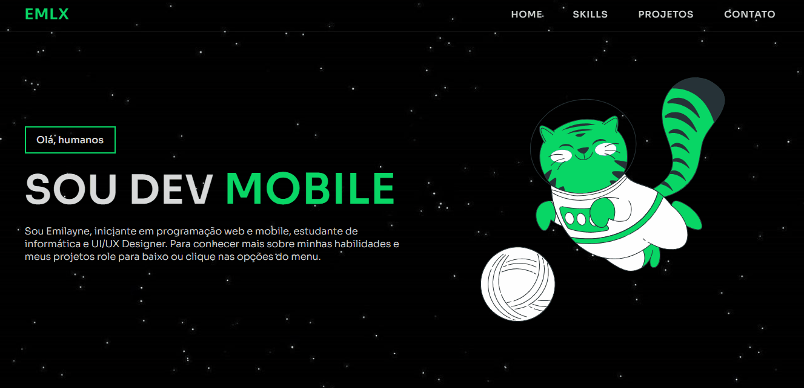

## EMLX | Portfolio
Portfólio criado a partir de um projeto pessoal para mostrar habilidades e tecnologias que venho estudando e aperfeiçoando durante os ultimos anos.

Este projeto foi desenvolvido inicialmente para a disciplina de proramação web, no entato, a vontade de criar uma landing page com informações sobre mim e os projetos que fiz sempre esteve na minha mente.

Até o momento ele possui poucos projetos a serem colocados a display, mas venho estudado e criado metas para criação de outros projetos durante o ano de 2023 para acrescentar no meu portfolio e praticar as ferramentas das quais possuo conhecimento.

No momento, minha maior meta é finalizar o aplicativo Te Controla e avançar no meu estudo sobre JavaScript, já que venho utilizando essa linguagem para o desenvolvimento no app e pretendo utilizada em outros projetos. Meu conhecimento em JS é básico, por este motivo aprender JavaScript se tornou uma de minhas prioridades.

Espero que se diverta e obtenha informações suficientes sobre quem sou! :)

## Demonstração

## Tecnologias Utilizadas

- HTML
- CSS
- JavaScript
- Typeit JS
- Swiper JS
- FontAwesome
- Form Submit

Este projeto está licenciado sob a [MIT License](LICENSE).
